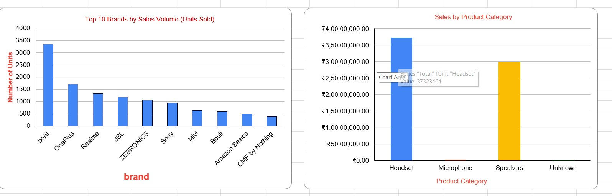

# Exploratory Data Analysis (EDA) of E-commerce Audio Sales

## 1. Project Objective
This project is a comprehensive analysis of a 2-month e-commerce transaction dataset (21,000+ rows) for audio hardware. The primary goal was to clean the raw data, perform exploratory data analysis (EDA) to identify sales trends, and present key business insights in a final dashboard.

**Tools Used:** Microsoft Excel, Pivot Tables, Data Cleaning, Data Visualization

---

## 2. Data Cleaning & Transformation
The raw dataset was unworkable and required significant cleaning. The following steps were taken to create the final, clean 19,162-row dataset:

* **Duplicate Removal:** Identified and removed over 1,800 duplicate transaction entries.
* **Data Type Correction (Critical):** Diagnosed and fixed the `price` column, which was incorrectly formatted as text due to hidden commas (e.g., "1,898.00"). This was resolved using Find & Replace and re-formatting the column as numeric, which was essential for all financial analysis.
* **Categorical Standardization:** Corrected data entry errors by merging inconsistent brand names (e.g., "SONY" and "Sony" were consolidated).
* **Missing Value Imputation:** Filled blank `level2_name` and `level3_name` cells with "Unknown" to preserve row integrity.
* **Irrelevant Data Removal:** Removed 4 empty columns that were artifacts of the initial data export.

---

## 3. Analysis & Key Insights
Using Excel Pivot Tables, I analyzed the clean data from four different perspectives. The 10 key insights are on the dashboard, with the most critical findings being:

* **Insight 1: The "Volume vs. Value" Split**
    * **Volume Leader:** **boAt** is the undisputed leader in *units sold* (3,346 transactions).
    * **Value Leader:** **Sony** is the market leader in *total sales revenue* (₹11.2M), proving a much higher average price per item.

* **Insight 2: Platform Duopoly**
    * The market is dominated by two platforms: **Amazon** (61.4% of revenue) and **Flipkart** (36.4%). All other platforms are negligible.

* **Insight 3: High-Value "One-Time Buyers"**
    * The user base consists of **13,900** unique customers.
    * A massive **75.5% (10,492 users)** made only **one purchase**, identifying a major opportunity for customer retention.

---

## 4. Final Dashboard
The final insights and visualizations were compiled into a single dashboard sheet for a clear, at-a-glance summary for stakeholders.

---

## 5. How to View This Project
The full project, including the clean dataset, all 4 pivot table analyses (Platform, Category, Brand, Frequency), and the final dashboard, is contained in the Excel file:
* **`refined_Dataset.xlsx`**
